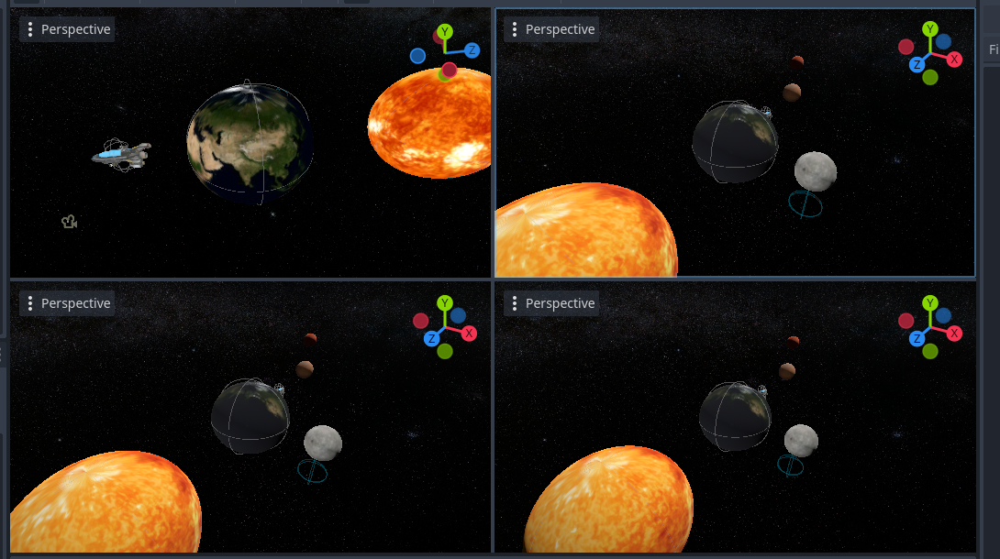

This project simulates a spaceship navigating a solar system with gravitational influences from multiple planets.
The spaceship can rotate along its local axes, apply thrust, and respond to environmental forces like gravity and drag.

 
## Acknowledgments
- Special thanks to Professor Roi Poranne for guidance and suggestions on improving the rotation mechanics and gravity simulation.
- Model assets from https://sketchfab.com/tags/godot
- Background music from : https://pixabay.com/sound-effects/search/space/
